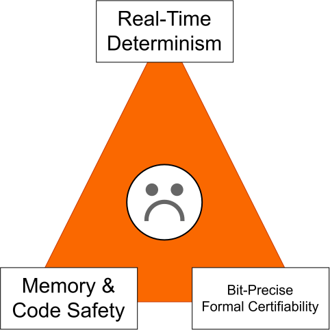

# Rusty-Soar

Rusty-Soar is a memory-safe, zero-GC Rust implementation of the [Soar cognitive architecture](https://soar.eecs.umich.edu/). It is designed for symbolic decision-making in embedded and safety-critical autonomous systems, with a `#![no_std]` core, deterministic data structures, and a bridge for checking Rust agent behavior against AADL/AGREE contracts.

The repository is under active development. The current implementation includes a working Rete-style production engine, working and semantic memory, preference resolution, impasse handling, episodic memory, chunking, reinforcement learning, a Soar rule parser, and contract-driven flight-control examples.



## Workspace

The Cargo workspace is in [`rusty-soar/`](rusty-soar/):

- [`rusty-soar-core`](rusty-soar/crates/rusty-soar-core) - `#![no_std]` Soar engine and public modules for agents, symbols, working memory, Rete matching, preferences, production rules, semantic and episodic memory, learning, reinforcement learning, impasses, TMS, and AADL/AGREE parsing.
- [`formal-soar-verify`](rusty-soar/crates/formal-soar-verify) - Kani proof harnesses for checking agent behavior against AGREE contracts.
- [`rusty-soar-cli`](rusty-soar/crates/rusty-soar-cli) - command-line verification and cross-compilation workflow for Soar rules and AADL contracts.

The repository also contains AADL specifications in [`aadl/`](aadl/) and sample Soar rules in [`rusty-soar/crates/rusty-soar-core/rules/`](rusty-soar/crates/rusty-soar-core/rules/).

## Requirements

- Rust stable and Cargo
- `rustup` for installing additional compilation targets
- Kani, only when running the formal proof harness

The core crate supplies fallback rules during a normal Cargo build. A custom rules file can be injected with the `SOAR_RULES_FILE` environment variable.

## Quick Start

From the workspace directory:

```bash
cd rusty-soar
cargo test --workspace
cargo run --example full_mvp -p rusty-soar-core
```

Run the other focused engine demonstrations with:

```bash
cargo run --example rete_demo -p rusty-soar-core
cargo run --example preference_demo -p rusty-soar-core
cargo run --example smem_demo -p rusty-soar-core
cargo run --example epmem_demo -p rusty-soar-core
cargo run --example chunking_demo -p rusty-soar-core
cargo run --example rl_demo -p rusty-soar-core
cargo run --example tms_demo -p rusty-soar-core
```

## Verify Rules Against AADL

The CLI parses a Soar production file, parses an AADL/AGREE contract, evaluates nominal and emergency flight scenarios, and then builds `rusty-soar-core` for the selected target:

```bash
cd rusty-soar
cargo run -p rusty-soar-cli -- \
	crates/rusty-soar-core/rules/flight_control.soar \
	test/specs/flight_control.aadl
```

Cross-compile by adding a target triple:

```bash
cargo run -p rusty-soar-cli -- \
	crates/rusty-soar-core/rules/flight_control.soar \
	test/specs/flight_control.aadl \
	--target x86_64-unknown-linux-gnu
```

Use `cargo run -p rusty-soar-cli -- --help` to list the target triples recognized by the CLI. Targets that need nightly Rust or `build-std` may require the fallback command printed by the CLI.

## Formal Verification

The `formal-soar-verify` crate contains a Kani proof that assumes valid sensor input and checks the current flight-control guarantees, including command validity and the emergency operator selection. Run it with Kani from [`rusty-soar/`](rusty-soar/):

```bash
cargo kani -p formal-soar-verify
```

The runtime AADL bridge tests and dynamic contract checks are part of the normal workspace test suite.

## Project Layout

```text
aadl/                         AADL/AGREE system and contract specifications
rusty-soar/
	crates/rusty-soar-core/     Core engine, rules, examples, and integration tests
	crates/formal-soar-verify/  Kani verification harness
	crates/rusty-soar-cli/      Verification and cross-compilation CLI
```

## License

Licensed under either of:

- [Apache License 2.0](https://www.apache.org/licenses/LICENSE-2.0)
- [MIT License](https://opensource.org/licenses/MIT)

